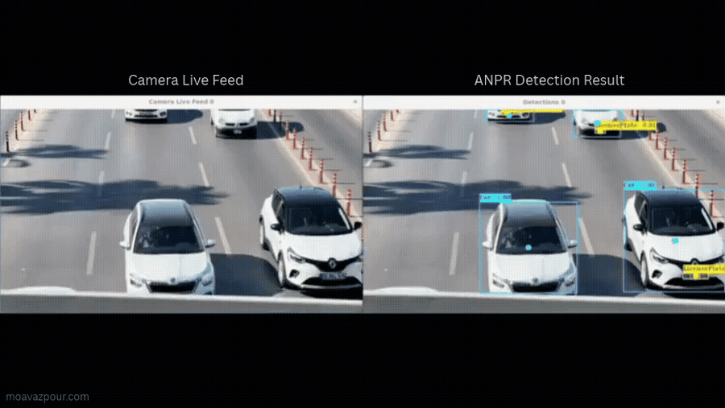

# Automatic Number Plate Recognition at the Edge



A real-time ANPR engine running on the edge computer beside each camera — plate detection, OCR, multi-object tracking and best-frame capture — built for customers' parking gates and industrial-site access control.

**[Live case study →](https://moavazpour.com/projects/automatic-number-plate-recognition)**

## Overview

The engine runs on the edge computer next to each camera: frames arrive over RTSP or straight from a Basler industrial camera, get run through YOLOv4 plate detection and OCR, and are tracked across frames so that each vehicle's clearest frame is the one that gets stored. Finished records are written to a local MySQL database and pushed to a central server over an encrypted REST API.

Built end to end — training data, the multithreaded C++ pipeline, and deployment on both NVIDIA Jetson boards and low-power industrial PCs.

- **Company:** Anamis Electronic Vira, Bandar Abbas
- **Role:** Computer Vision & Perception Engineer
- **Timeframe:** 10/2022 — 02/2025

## Problem & context

The engine had to read plates reliably for customers' parking gates and industrial-site access control — in Bandar Abbas's strong sun, glare, dust and full darkness — from an edge computer already mounted in the roadside cabinet next to each camera. That computer ranged from a Jetson Nano down to a low-power Intel Atom industrial PC, so the pipeline had to make every one of those budgets work rather than assuming capable hardware. Every finished record then had to reach a central server over a secure link the rest of the company's software could also consume.

## My role

I owned the computer-vision and edge-software side of this project: selected and structured the training data, trained and evaluated the detection models, wrote the real-time C++ pipeline end to end, integrated the Basler cameras, and designed the REST APIs plus the C++ DLL that the company's existing C# UI application calls into via P/Invoke.

## Architecture

```
Basler camera            Edge computer                MySQL          REST API           Central
+ LED flash    ───────►  YOLOv4 detection    ───────►  (local)  ───► HTTPS / TLS ─────►  server
                          OCR + tracking                record
                          (Jetson / industrial PC)      storage
```

## Key technical decisions

### Data and model
- Selected and curated 7,000+ real-world images of cars, motorcycles and plates — different weather, light and viewing angles — and defined the dataset structure for the plate-reading model.
- Trained and evaluated several YOLOv4 detection models, trading detection accuracy against inference speed on constrained edge hardware.

### Real-time C++ pipeline
- Moved the performance-critical parts from Python to multithreaded C++: RTSP frame acquisition, YOLO inference, OCR post-processing and MySQL storage, with the life cycle of every camera connection managed by the engine.
- Evaluated OpenCV, GStreamer and libVLC as streaming back ends to keep frames flowing over unstable camera links.
- Skipped static frames with frame-level motion detection, and added direction of travel, multi-object tracking and automatic selection of each vehicle's clearest frame for the most reliable read.

### Running on weak edge hardware
- Up to 12 FPS end to end — frame in, database row out — on standard edge PCs, with frame buffering so bursts of traffic aren't lost.
- On an Intel Atom E3845 capped at 5 FPS against a 15 FPS camera, under 5% of the street traffic was captured; motion-gated, centre-ROI buffering feeding a dedicated YOLO thread raised coverage to 91% within the same budget.
- On NVIDIA Jetson Nano, TensorRT brought YOLOv4 to ~25 FPS — no missed vehicles on up to 4 cameras per device. A CUDA-accelerated OpenCV DNN mode scaled denser multi-camera sites.

### Cameras and integration
- Integrated Basler industrial cameras through the Pylon SDK in C++: direct frame acquisition, exposure control and sync with the external LED flash.
- Designed encrypted REST APIs over HTTPS/TLS: one for camera-to-server data, and an integration API the web UI used to control the engine and fetch results.
- Wrote a native C++ DLL with the plate-recognition logic, used through P/Invoke by the production C# UI application.

## Real deployment — 70+ cameras in three cities

The engine was piloted on 8 cameras for customers' parking gates and industrial-site access control, then — based on the measured accuracy — scaled to more than 70 cameras across three cities, 50+ of them in Bandar Abbas, Iran. Accuracy was measured in real-world, varied-weather conditions.

*Published with the permission of Anamis Electronic Vira.*

| Metric | Value | Context |
|---|---|---|
| Plate detection accuracy | 99.1% | real-world, varied weather |
| Character recognition | 97.4% | real-world, varied weather |
| Cameras deployed | 70+ | 8-camera pilot → three cities |
| End-to-end throughput | 12 FPS | frame in → database row, standard edge PC |
| NVIDIA Jetson Nano | ~25 FPS | TensorRT, no missed vehicles on up to 4 cameras |
| Capture coverage, Intel Atom | 5% → 91% | motion-gated frame buffering, same 5 FPS budget |

## Tech stack

C++ · Python · OpenCV · YOLOv4 · PyTorch · CUDA · TensorRT · NVIDIA Jetson · Embedded Linux · Multithreading · RTSP · GStreamer · libVLC · Basler Pylon SDK · MySQL · REST APIs (HTTPS/TLS) · Multi-object tracking · C++ DLL / P/Invoke

## Source code

This repository documents the project for portfolio purposes. The production source code itself remains proprietary to Anamis Electronic Vira — happy to walk through the architecture and trade-offs in an interview.

## License

[MIT](LICENSE) — applies to the documentation in this repository.
